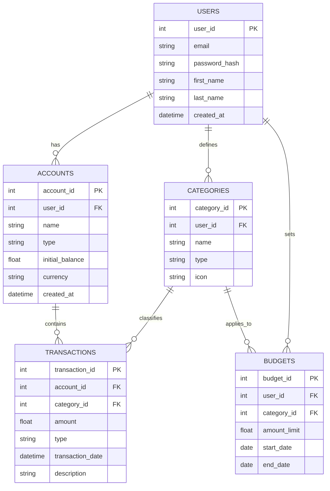

# Expense Manager

Goal : Manage expenses efficiently, and don't be broke at the end of the month...

## Launch via docker-compose

```bash
docker-compose up -d
```

# Database


```mermaid
erDiagram
    USERS ||--o{ ACCOUNTS : has
    ACCOUNTS ||--o{ TRANSACTIONS : contains
    USERS ||--o{ CATEGORIES : defines
    CATEGORIES ||--o{ TRANSACTIONS : classifies
    USERS ||--o{ BUDGETS : sets
    CATEGORIES ||--o{ BUDGETS : applies_to

    USERS {
        int user_id PK
        string email
        string password_hash
        string first_name
        string last_name
        datetime created_at
    }

    ACCOUNTS {
        int account_id PK
        int user_id FK
        string name
        string type
        float initial_balance
        string currency
        datetime created_at
    }

    TRANSACTIONS {
        int transaction_id PK
        int account_id FK
        int category_id FK
        float amount
        string type
        datetime transaction_date
        string description
    }

    CATEGORIES {
        int category_id PK
        int user_id FK
        string name
        string type
        string icon
    }

    BUDGETS {
        int budget_id PK
        int user_id FK
        int category_id FK
        float amount_limit
        date start_date
        date end_date
    }
```
